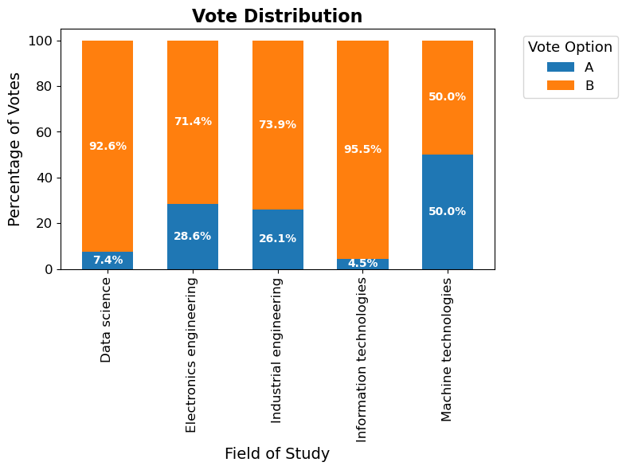
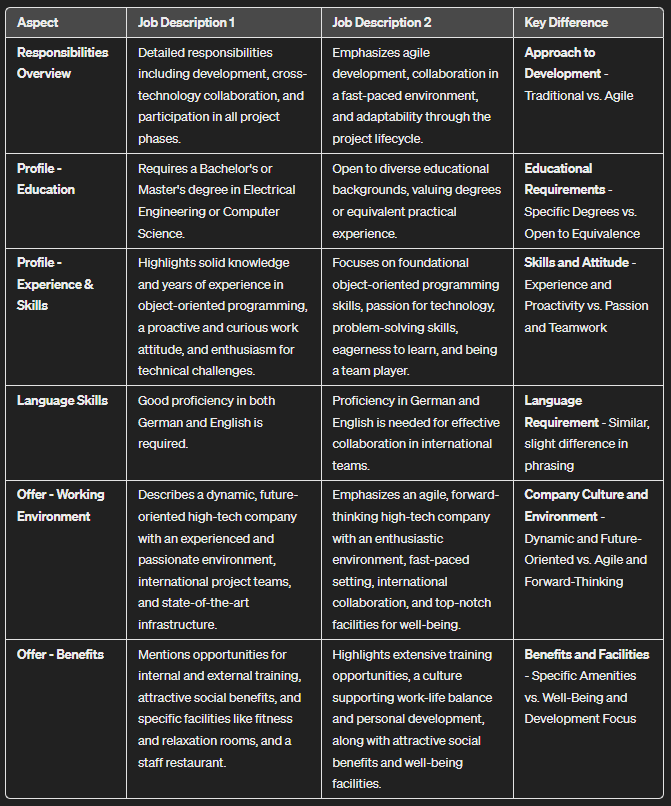

# A/B Test Using Generated Personas and LLMs

## Table of Contents
- [Introduction and Project Description](#introduction-and-project-description)
- [Getting Started](#getting-started)
  - [Prerequisites](#prerequisites)
  - [Installation](#installation)
- [Usage](#usage)
  - [Creating Personas](#creating-personas)
  - [Setting Up Job Descriptions](#setting-up-job-descriptions)
  - [Prompting and Testing with LLMs](#prompting-and-testing-with-llms)
  - [Creating a Survey](#creating-a-survey)
  - [Illustrating Votes by Studies](#illustrating-votes-by-studies)
- [A/B Testing](#ab-testing)
  - [Evaluation Methodology](#evaluation-methodology)
  - [Interpretation of Results](#interpretation-of-results)
- [License](#license)
- [Author](#author)
- [Acknowledgements](#acknowledgements)

## Introduction and Project Description

This project demonstates fast and extensive comparison and evaluation possibilities of two sets of content items `A` and `B` by A/B testing means using generated personas in combination with large language models (LLMs). For demonstration purposes, job descriptions are used. Fittingly, as for personas, gratuates of different fields of study are created. 

Of course, the scope of such comparisons is not limited to job descriptions. With slight modifications, images such as landing sites and design choices can be compared quite easily and extensively, e.g. using GPT Vision.

## Getting Started

### Prerequisites

Before you can run the demonstration notebook `01_personas_and_AB_test.ipynb` of this project, you'll need to have the following installed on your system:

- Python 3.9.12: Ensure you have Python version 3.9.12 installed. You can download it from [python.org](https://www.python.org/downloads/release/python-3912/) or use a version manager to install this specific version.

Additionally, you'll need an API key from OpenAI to use their models:

- OpenAI API Key: Obtain an API key by creating an account at [OpenAI](https://openai.com/api/) and following their instructions to generate an API key.

### Installation

1. **Clone the Repository:**

   Start by cloning this project to your local machine. You can do this by running the following command in your terminal:

   ```bash
   git clone https://github.com/mathiasschilling/AB-test-of-job-descriptions-using-personas-and-LLMs
   ```
   
2. **Create a Virtual Environment (Optional):**

  It's recommended to create a virtual environment to manage the dependencies for the project. You can create one using `venv` by running:

  ```bash
  python3 -m venv env
  source env/bin/activate  # On Windows, use `env\Scripts\activate`
  ```

3. **Install Required Packages:**

  Install all the required packages using the pip command. Make sure you are in the project directory and run:
  
  ```bash
  pip install pandas numpy requests matplotlib statsmodels
  ```

4. **Set Up OpenAI API Key:**

  Create a file named `config.py` in the root of the project directory. Add your OpenAI API key to this file as shown below:
  
  ```python
  api_key = 'your_private_api_key_from_openai'
  ```

  Replace 'your_private_api_key_from_openai' with the actual API key you obtained from OpenAI.

5. **Verification:**

  Ensure that all installations are correct and packages are working as expected. You can run a simple Python script to check if the packages are imported correctly.
  
Once you've completed these steps, you're ready do use the jupyter notebook `01_personas_and_AB_test.ipynb` which is an example how to perform the A/B testing.
  

## Usage

### Creating Personas

Personas with different traits, skills and interests can be created using LLMs.

Here, in order to create realistic and diverse personas, we generate 100 personas of students from 5 fields of studies: machine technology, electronics engineering, data science, information technology, and industrial engineering. Each persona has the following selected and reviewed attributes:

- `name`: Randomly created names.
- `study`: One of the five fields of studies mentioned above.
- `skills`: A list of skills that are relevant to the chosen field of study, such as programming languages, software tools, mathematical concepts, etc. The skills are randomly selected from a predefined pool of skills for each field of study, with some variation to allow for different levels of proficiency and specialization.
- `professional_interests`: A list of topics or domains that the persona is interested in pursuing as a career, such as artificial intelligence, robotics, cybersecurity, etc. The professional interests are tied do the fields of study.
- `private_interests`: A list of hobbies or activities that the persona enjoys doing in their spare time, such as sports, music, gaming, reading, etc. The private interests are randomly selected from a general pool of interests that are not related to the field of study or the professional interests.
- `social_skills`: A list of social skills. The social skills are randomly assigned to each persona.

The initial persona traits, skills and interests can easily be adjusted and expanded.

In function `get_persona(idx)`, where `idx` is the index/persona, we create the persona based on the traits, skills and interests associated in the data frame.

### Setting Up Job Descriptions
The cornerstone of this project is the comparison of different job descriptions to understand which are more effective in attracting the right candidates. Begin by drafting two versions of job descriptions for the same role: `job_description_A` as the control version (the current job description used) and `job_description_B` as the experimental version (with potentially more engaging and inclusive language, clearer role responsibilities, or other modifications). These descriptions should be reflective of the role's requirements and the organization's culture. The effectiveness of each description is later assessed through A/B testing, leveraging the unique perspectives of our generated personas.

Example job descriptions are defined in the jupyter notebook `01_personas_and_AB_test.ipynb`.

### Prompting and Testing with LLMs
Once personas and job descriptions are established, the next step involves interacting with LLMs to simulate how each persona would react to the job descriptions. This involves crafting prompts that summarize the job descriptions and the persona's profile, querying the LLM for its preference or reaction towards the descriptions.

The function `get_prompt()` creates a prompt that will be used to get votes for either item `A` or `B` using LLMs.

### Creating a Survey

To systematically capture the preferences of our personas for job description A vs. job description B, we create a survey. This survey is designed to gather the votes of each persona on which job description they find more appealing or suitable. Implementing this survey involves scripting a process where each persona, represented by their profile data, is 'asked' to choose between the two descriptions. The survey is automated to process all personas sequentially, recording their preferences and preparing the data for statistical analysis to determine the more effective job description.

### Illustrating Votes by Studies

After collecting votes from personas on their preferred job descriptions, it's important to visualize and analyze these preferences across different fields of study. This step involves creating graphical representations, to illustrate how personas from different academic backgrounds (e.g., machine technology, electronics engineering, data science) voted. 



Such illustrations can reveal trends and patterns, highlighting which job descriptions resonate more with candidates from specific fields. This analysis is crucial for understanding how to tailor job descriptions to attract diverse talents effectively.


## A/B Testing

### Evaluation Methodology
The evaluation methodology of the A/B testing relies on statistical analysis to measure the effectiveness of the two job description versions. Utilizing the `proportions_ztest` from the `statsmodels` package, this process compares the proportion of positive responses each job description receives from the personas. By setting a controlled environment where other variables are kept constant, this approach ensures that the observed differences in preferences are attributable to the variations in the job descriptions.

### Interpretation of Results

**1. Z-statistic:**

The Z-statistic represents the distance between the observed difference in proportions and the null hypothesis value (typically, the null hypothesis states that there is no difference between the two proportions), expressed in the number of standard deviations. A Z-statistic of 0 indicates that the observed difference is exactly the same as the null hypothesis value.

**2. p-value:**

The p-value helps us determine whether the observed differences are statistically significant. It represents the probability of obtaining test results at least as extreme as the ones observed during the test, assuming that the null hypothesis is true. In the context of an A/B test, a p-value less than 0.05 (common threshold) suggests that there is a statistically significant difference in preferences between the two versions tested, leading us to reject the null hypothesis (meaning the second job description is better).

## Additional Remarks

- The A/B test surveys shall be conducted multiple times (multi-shot surveys) as the results obtained by the LLM of choice also tend to scatter. Personas without affiliation/overlap to the tested content shall also be included in the surveys to test obtaining ambivalent results.
- If the content is significantly different from each other in terms of votes, prompt an LLM to identify the differences which might have led to these results. In terms of job descriptions, those differences might be tied to responsibilities, required education, additional expertise and skills, working environment, benefits...



## License

This project is made available under the terms of the MIT License. This means everyone is free to use, copy, modify, merge, publish, distribute, sublicense, and/or sell copies of the software, provided they do so under the same license and give appropriate credit to the original author(s) of this project by referencing it in their work.

While not required, if you find this project helpful and wish to express your appreciation, I would be grateful for a coffee donation. Donations can be made to the following Ethereum/Polygon wallet address: `0x9F74DbeeA147D6DcF5Da550EDa3DDa0FF92e7daA`. Your support is greatly appreciated.

## How to Cite This Project

If you utilize this project in your research, development work, or in any other capacity, please consider citing it as follows:

Schilling, M. (2024). A/B Test Using Generated Personas and LLMs. GitHub. https://github.com/mathiasschilling/A-B-Test-Using-Generated-Personas-and-LLMs

## Author

This project was created by Mathias Schilling, a passionate algorithm developer and data scientist with a keen interest in applying technology to solve real-world problems. With a background in systems engineering, Mathias brings a unique perspective to the intersection of data science, applied machine learning, RAG and data-driven analysis and modeling. This project reflects his commitment to innovative approaches in optimizing processes through the power of LLMs and data-driven insights.

For any inquiries or collaborations, feel free to connect on [LinkedIn](https://ch.linkedin.com/in/mathias-schilling).

## Acknowledgements

Thank you [David Furrer](https://www.linkedin.com/in/david-furrer/) for creating the concise job description comparison. David is the Principal Course Instructor & Technical Lead at [gpttraining.ch](https://www.gpttraining.ch/). Check out his profile and course!
